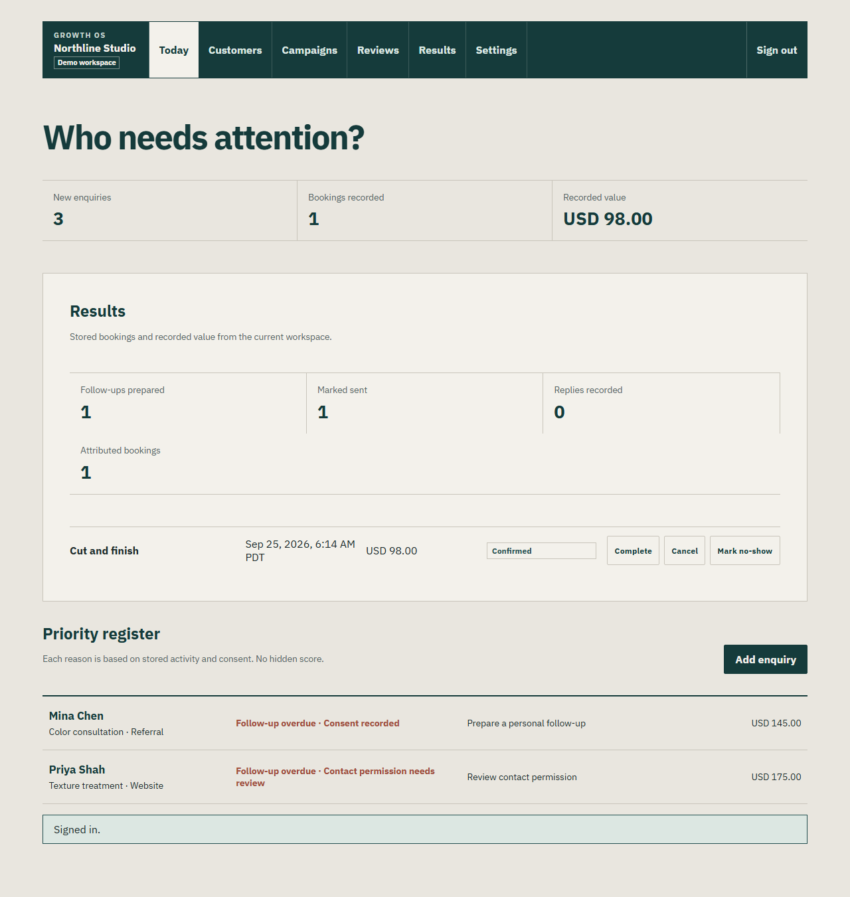
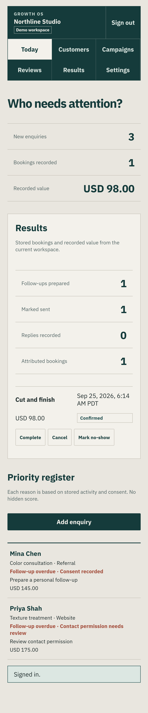
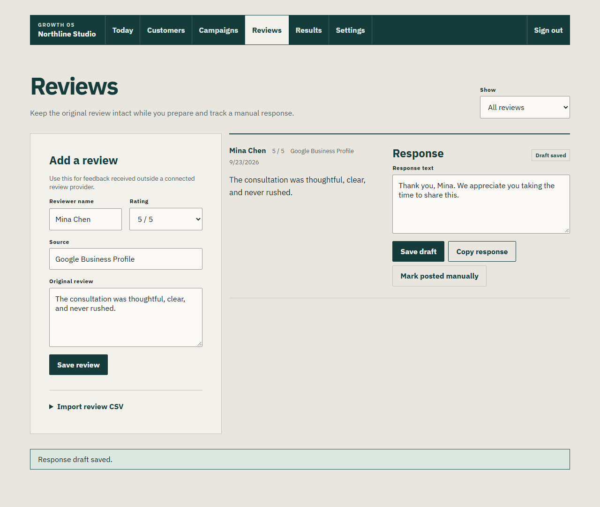
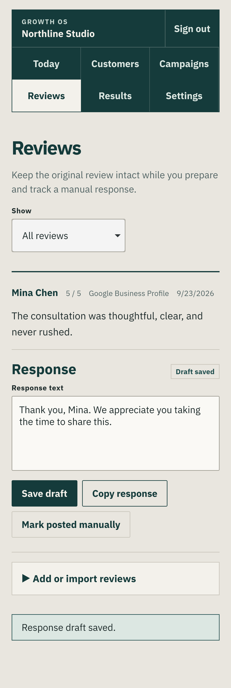
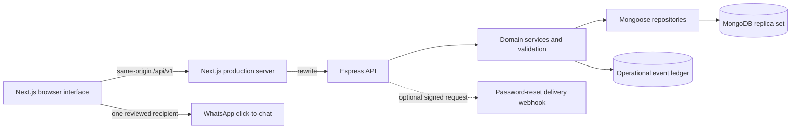
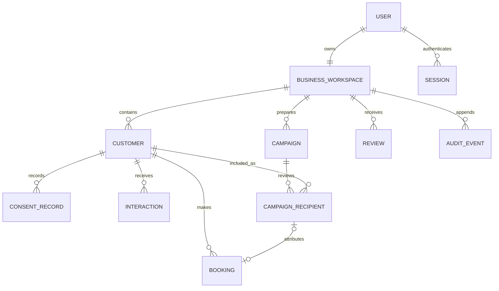
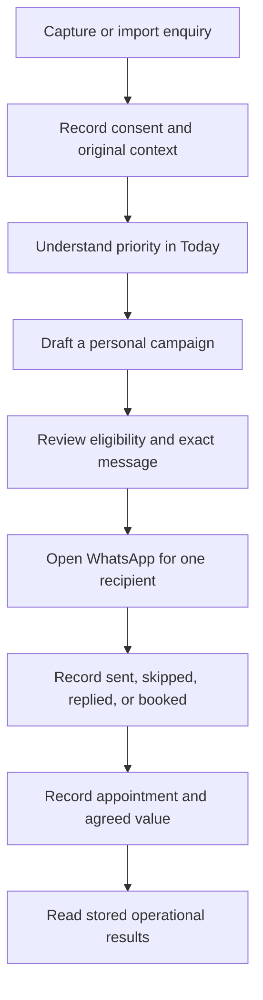

# Growth OS case study

## Summary

Growth OS is a production-oriented operating workspace for a salon or appointment business. It turns scattered enquiries into a traceable daily process: capture context, respect contact permission, prepare a personal follow-up, record the resulting booking, and report only stored outcomes.

The implementation is a TypeScript npm workspace with a Next.js interface, an Express API, and MongoDB transactions. The demo account uses the same API and database as every other account. It is labeled as fictional throughout the authenticated product.

## Product assumptions

These are hypotheses, not research findings:

- Owners lose follow-up context when enquiries are split between chat apps, calls, and spreadsheets.
- A transparent priority register will be easier to trust than a hidden score.
- Owners need to compare several enquiries before choosing the next action.
- Manual WhatsApp handoff is acceptable for the first release when the product never claims provider delivery.
- Recorded booking value is useful operational evidence even though it is not collected revenue.

The research plan in [research-plan.md](research-plan.md) defines the interviews and usability work needed to test these assumptions. No interview, conversion, or revenue result has been invented for this case study.

## Implemented behavior

The completed product supports registration, secure sessions, onboarding, password recovery through a delivery-provider boundary, customer creation and bounded CSV import, duplicate review, consent history, campaign preparation, recipient eligibility checks, WhatsApp click-to-chat, booking attribution and status changes, review-response drafts, stored Results, exports, settings, deletion, legal drafts, and a database-backed demo.

Today explains why each enquiry needs attention. Campaign activation rechecks consent and booking state. Results separates quoted value from recorded booking value and does not display collected revenue. Important changes append typed operational events.

The Reviews workspace preserves the original review while the owner drafts, copies, and manually records a response.

## Architecture

The API owns authorization and derives `workspaceId` from the server session. MongoDB transactions keep multi-record commands atomic. The web server exposes the API under the web origin, so browser cookies do not require a cross-origin configuration.

## Domain model

All business records carry `workspaceId`. Money is stored as integer minor units, timestamps are stored in UTC, and business dates render in the workspace timezone. Status values and valid transitions are defined in shared contracts and enforced again by the API.

## Main user flow

The browser suite exercises this flow on desktop and phone. The API suites separately prove workspace isolation, transaction boundaries, idempotency, stale campaign conflicts, suppression after consent withdrawal, and invalid status rejection.

## Design decisions

The interface uses a working-register composition: warm mineral surfaces, ink navigation, compact factual rows, editorial headings, and thin dividers. It avoids dashboard-card decoration and keeps the comparison set visible. Phone layouts turn dense grids into labeled records without hiding actions.

Interaction feedback is restrained. Buttons have press feedback; dialogs enter briefly, trap focus, close with Escape, and restore the trigger; reduced-motion preferences reduce animation and transition durations to effectively zero. Loading uses plain text in the final layout rather than shimmer placeholders.

## Test evidence

Evidence was captured on September 23, 2026, on Windows 10 with an AMD Ryzen 5 5600X, 12 logical CPUs, 16 GB memory, Node.js 24.21.0, Docker Engine 29.8.0, and Docker Compose 5.5.1.

- Unit tests: 12 files and 30 tests passed.
- API integration tests: 4 files and 9 tests passed against MongoDB replica sets.
- Source browser suite: 19 passed and 1 intentional project skip across Chromium and the iPhone 13 profile.
- Production-container browser suite: 17 passed and 3 intentional skips. Password-reset completion is skipped only when the external delivery webhook is absent; its provider contract and single-use behavior are covered in integration and source-browser tests.
- Responsive checks covered 390 px phone behavior plus 768 × 1024, 912 × 900, 1366 × 768, and 1920 × 1080 viewports.
- Automated accessibility checks found no serious or critical axe violations on the six authenticated primary screens.
- The production stack survived a MongoDB, API, and web restart; the seeded active campaign remained visible afterward.
- `npm audit --audit-level=high` reported zero vulnerabilities.
- Docker Scout reported 0 critical and 0 high vulnerabilities in both final runtime images.

The full command record is in [verification.md](verification.md).

## Measured technical results

The authenticated Today view was measured against the local production Compose stack. Lighthouse used a desktop profile with the seeded workspace and the local supplied network, so these are development-machine measurements rather than public-internet claims.

| Measure                  | Result |                       Target |
| ------------------------ | -----: | ---------------------------: |
| Lighthouse performance   |    100 |                  at least 90 |
| Lighthouse accessibility |    100 |                  at least 95 |
| Largest Contentful Paint | 475 ms |                  below 2.5 s |
| Cumulative Layout Shift  | 0.0026 |                    below 0.1 |
| Total Blocking Time      |   0 ms | recorded, no product promise |

The authenticated API smoke test issued 240 reads across Today, Results, Customers, Campaigns, Reviews, and Bookings at concurrency 12. It completed with zero errors at 241.3 requests per second, with 32 ms p50, 81 ms p95, 155 ms p99, and 158 ms maximum latency. This is a local baseline, not a capacity claim.

The raw [Lighthouse report](performance/lighthouse-today.html), [Lighthouse JSON](performance/lighthouse-today.json), and [load-smoke JSON](performance/api-load-smoke.json) are committed as evidence.

## Research still required

- Interview owners and managers from several appointment-business categories.
- Observe whether the priority explanations support confident action without training.
- Test CSV terminology and duplicate decisions with real export formats.
- Evaluate campaign review speed and error recovery on owners' own phones.
- Determine whether manual outcome recording is sustainable during a busy week.
- Validate retention expectations and obtain legal review of the Privacy and Terms drafts.

## Deliberately excluded future work

- Automated bulk messaging or unverified delivery claims.
- WhatsApp Cloud API delivery until credentials, templates, consent operations, and webhook handling can be verified.
- Google Business Profile review synchronization until external credentials are available.
- Team roles, enterprise permissions, workflow builders, predictive scoring, collected-revenue accounting, and fabricated business-impact claims.
- Public deployment configuration, backup operations, and legal approval, which depend on an operator and external services.
